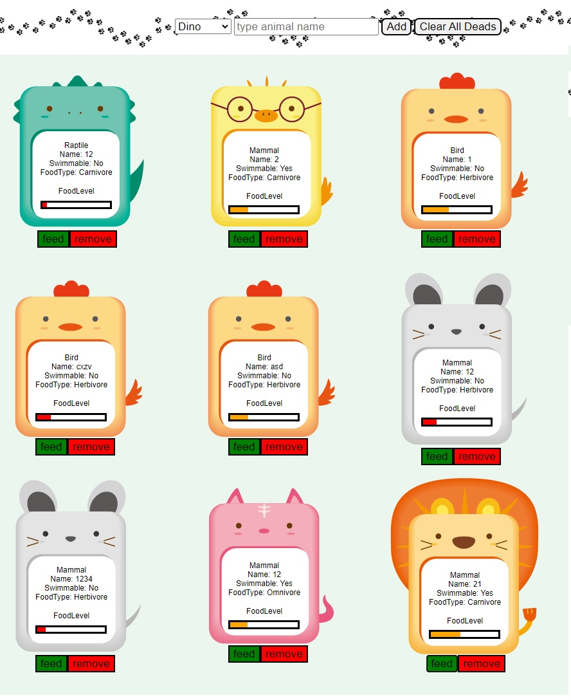

# Project_Zoo Tycoon

</img>

This is mini project practicing OOP concept of JavaScript.<br />
## Plan
* ~~Scrub image resources if animals~~
* ~~Design app workflows~~
* Understanding OOP in JS

## Resources
Imgage : https://www.pngegg.com/ko/png-bfcwi
Image cutting tool : Photoshop

## Design
* Each category's max capacity is 10
* Each animal has name, foodLevel, own character(swimmable)
* User can feed animals if animal's foodLevel is below...

1. main page = control section on header, main zoo on main
3. import or create animal with `add` button
  3-1. click `add` will show detail card (name, category)
  3-2. animal generated with own foodLevel, type, ability
  3-3. `cannot add` if the capacity is 10 OR same name in the type already exist
4. remove animal with `remove` button
  4-1. click `remove` will show all lists of animals
  4-2. click animal want to remove
  4-3. click `confirm` will remove the animal
5. feed animals if animal's foodLevel is below.. ?
  5-1. click feed on animal card 
6. clear all dead animals with clear button in header


## module import vs require
* Import => provided by ES6
1. syntax = import moment from "moment";
2. pros
  2-1. readability with `import, from, export, default`
  2-2. only import required parts which is good for memory
* require => provided by Node.js
1. syntax = const moment = require("moment");

## child Class extends(inherit) parent Class
* Must call super constructor in derived class before accessing 'this'
```js
  class Parent {
    constructur(types) {
      this.types = types
    }
  }

  class Child extends Parent {
    // INVALID
    constructor(type) {
      this.type = type
      super();
    }
    // VALID
    constructor(type) {
      super();
      this.type = type
    }
  }
```

## ES6 Class getter and setter
https://developer.mozilla.org/en-US/docs/Web/JavaScript/Reference/Functions/get
* private
https://developer.mozilla.org/en-US/docs/Web/JavaScript/Reference/Classes/Private_class_fields

### Animal types
* Mammal : Cat, Fox, Lion, Rabbit, Sheep
* Bird : Chicken, Penguin, Duck
* Reptile : Dino

### FoodType
* Herbivore
* Carnivore
* Omnivore

## Process
1. html structuring
2. css to make animal image and details inside image
3. javascript

## Charset UTF-8
The HTML5 specification encourages web developers to use the UTF-8 character set, which covers almost all of the characters and symbols in the world!

## private
https://developer.mozilla.org/en-US/docs/Web/JavaScript/Reference/Classes/Private_class_fields

Class fields are `public` by default, but private class members can be created by using a hash `#` prefix. The privacy encapsulation of these class features is enforced  by JS itself.

Private members are not native to the language before this syntax existed. In prototyppical inheritance, its behavior may be emulated with `WeakMap` opjects or `closures`, but they can't compare the `#` syntax in terms of ergonomics

`private static` method cannot be used by instance. can accessible inside class

```js
  // private instance method
  class ....{
    #name
    #age
    constructor() {
      this.#name....
      this.#age...
    }
  }
  // private instance field
  class ....{
    #checkName() {

    }
  }
```

## getter and setter
```js
  class Person {
    constructor(name) {
        this.name = name;
    }
    get name() {
        return this._name;
    }
    set name(newName) {
        newName = newName.trim();
        if (newName === '') {
            throw 'The name cannot be empty';
        }
        this._name = newName;
    }
}
const mike = new Person("mike");

// use getter
mike.name // return  "mike"
// use setter
mike.name = "mikeYun"
mike.name // return "mikeYun"
```